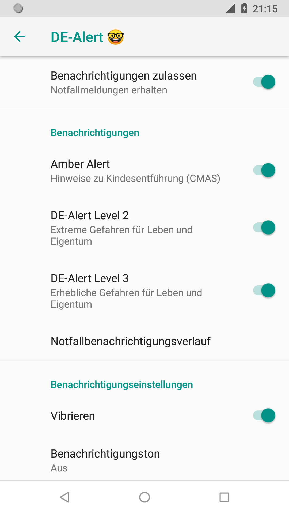

DE-Alert for Android 8.1 Oreo
=============================



This is just a Demo implementation of a Resource Overlay for `com.android.cellbroadcastreceiver` as described on [CellBroadcast](https://source.android.com/devices/architecture/modular-system/cellbroadcast#customizing) and [Runtime Resource Overlays (RROs)](https://source.android.com/devices/architecture/rros#overlaying-resources).

You need to open this Project with [Android Studio](https://developer.android.com/studio).

I made and tested this on my Nexus 5X to gain more knowledge on how Cell Broadcast and Emergency Warnings work on Android.

This Android App (apk) has no code. It just has some resources (strings and configuration values) to configure and re-label the workings of Androids CellBroadcastReceiver.

Files
-----
- [app\src\main\AndroidManifest.xml](app\src\main\AndroidManifest.xml)  
  Contains the main manifest file which tells Android that this is an overlay for the system app `com.android.cellbroadcastreceiver`.
- [app\src\main\res\values-mcc262\config.xml](app\src\main\res\values-mcc262\config.xml)  
  Contains additional Cell Broadcast Channels and configurations for german mobile networks (Mobile Country Code 262). This is not really needed as Android subscribes to DE-Alert/CMAS channels by default, but you can specify additional channels here, like 221 for Telefónica o2.
- [app\src\main\res\values-mcc262-de\strings.xml](app\src\main\res\values-mcc262-de\strings.xml)  
  Contains the german translation / labels for the UI.


Installation
------------
In Android Studio hit *"Play"* OR compile the apk using *"Build" - "Build Bundle(s)/APK(s)" - "Build APK(s)"* and install it using adb. You can use `install-apk.bat` for that.
After that you need to restart Android either by restarting the phone or executing `stop && start` if you're root on the phone.

On Overlays
-----------
Ive never worked with overlays. If I understand it correctly, on Android 8.1 Oreo any APK can overlay ANY APKs resources on the system. This changed with later versions where `overlayable.xml` was added to define which resources could be overlayd and also a signature check was required. Trying to install this on Android 12 results in `Failure [INSTALL_FAILED_INTERNAL_ERROR: Scanning Failed.: Overlay com.example.overlaytest and target com.android.cellbroadcastreceiver signed with different certificates, and the overlay lacks <overlay android:targetName>]`.
On the other hand, trying to install on 5.1 results in `Failure [INSTALL_PARSE_FAILED_MANIFEST_MALFORMED]` 🤷‍♂️.

Useful commands
---------------
ADB commands
```bash
# (re)install APK
adb install -r app\build\outputs\apk\debug\app-debug.apk
```

Commands on the device
```bash
# Manage, enable or disable the overlays
cmd overlay dump
cmd overlay enable com.example.overlaytest
cmd overlay disable com.example.overlaytest

# Show where the package got installed
pm path com.example.overlaytest

# Uninstall the overlay
pm uninstall com.example.overlaytest

# Remount filesystem writable (root required)
mount -o rw,remount /system
mount -o rw,remount /vendor

# Stop and (re)start Android to actually apply the overlay (faster than reboot, requires root)
stop
start
```

Use `adb logcat` to confirm that the phone actually subscribed to the requested channels:
```
D IccSmsInterfaceManager: [IccSmsInterfaceManager] Added GSM cell broadcast subscription for MID range 4370 to 4370 from client com.android.cellbroadcastreceiver
D IccSmsInterfaceManager: [IccSmsInterfaceManager] Added GSM cell broadcast subscription for MID range 919 to 928 from client com.android.cellbroadcastreceiver
```